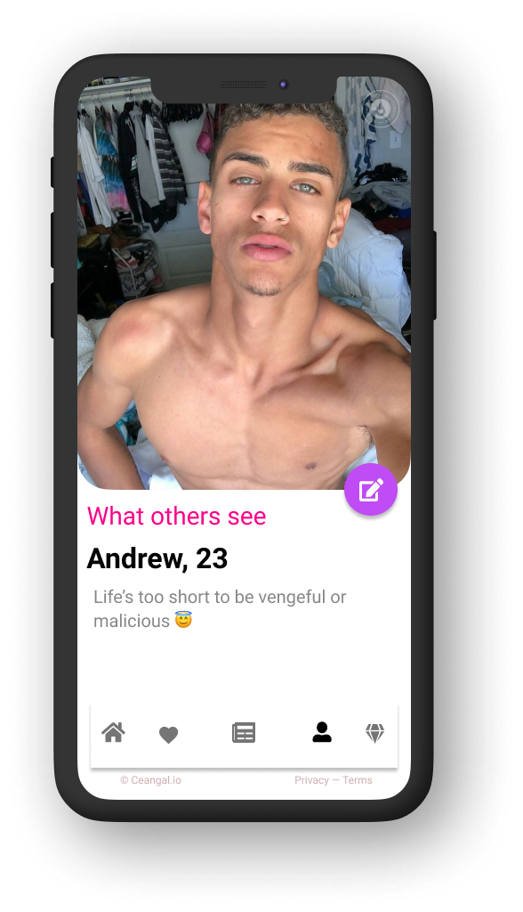
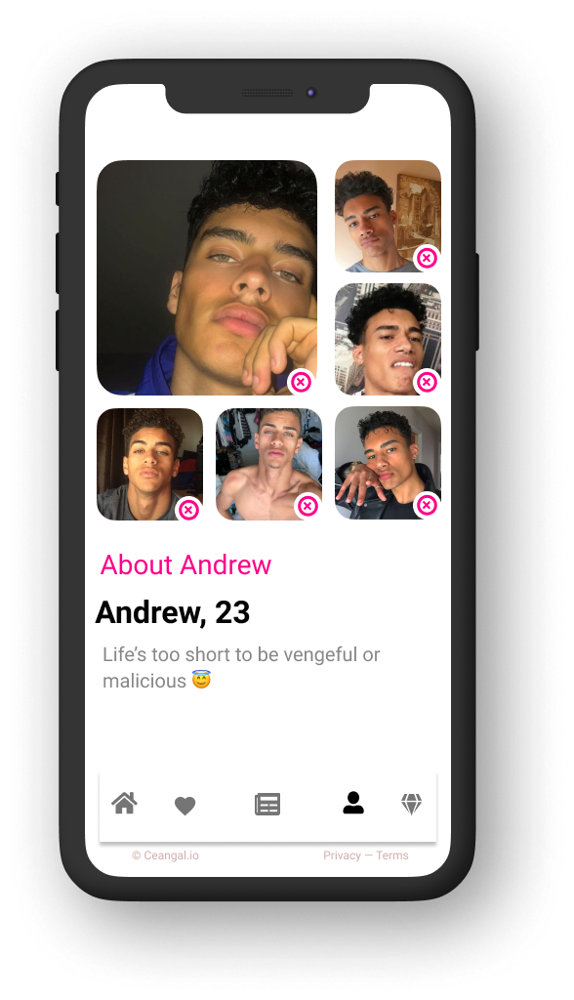
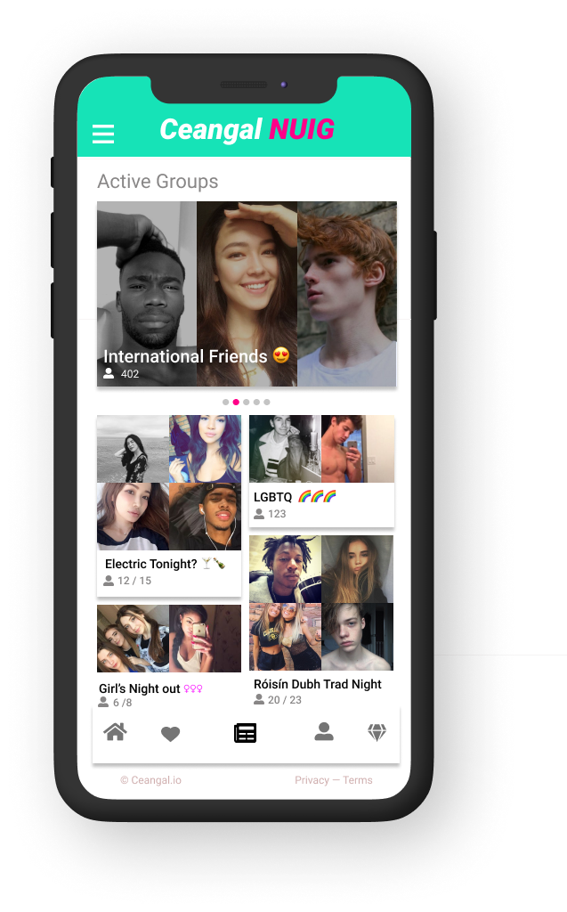
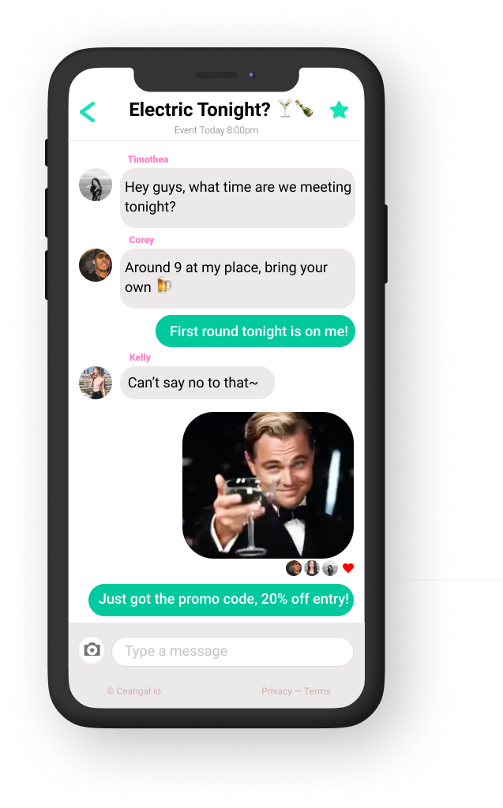
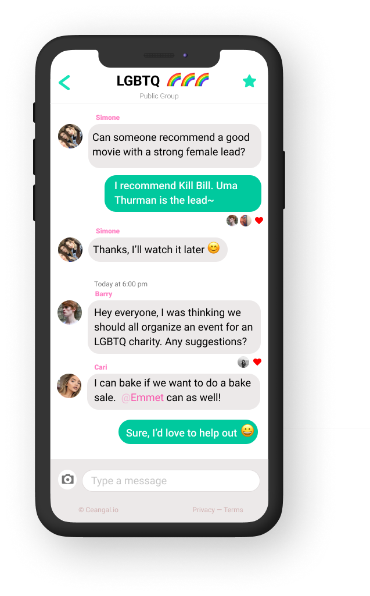

# specification for the ceangal prototype pitch

---
## _story 1 -  Signup Process_
### 1.1

> Demonstrate how easy the signup process is for the client / investor for Univesity students with a .edu email

> Picking the user's preference

> Classifying user gender

> name

> .edu email

> Birthday

> current course (debate whether they should input course code but i highly doubt it)

---

---
## _story 2 - User Customization_
> Demonstrate the appeal of customizing the user's profile, showcase personalization, and the attractiveness of the user (no camera feature, select from camera roll)

---

---
## _story 3 - Ceangal Social Landing Page_
> Demonstrate event group and social group functionality 

> - Social Feed

> - Event Group Chat

> - Social Group Chat 

---
## _story 4 - Ceangal Dating Landing Page_ 
> animations

[myimage]: relative/urls/cool/image.jpg "if you need a title, it's here"
[myimage]: relative/urls/cool/image.jpg "if you need a title, it's here"
---

---
## _story 5 - Ceangal Business Navigation_ 
> animations

[myimage]: relative/urls/cool/image.jpg "if you need a title, it's here"
[myimage]: relative/urls/cool/image.jpg "if you need a title, it's here"
---

